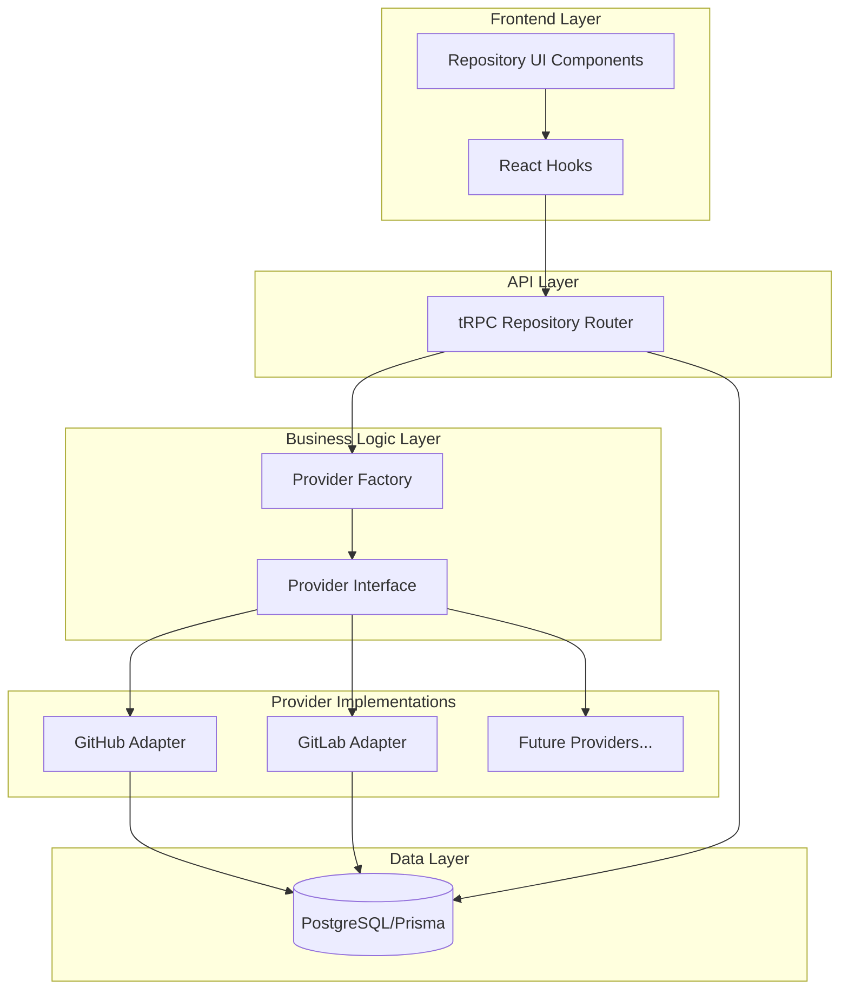

# Design Document: Multi-Provider Git Support

## Overview

This design document outlines the architecture for refactoring the existing GitHub-only PR review application to support multiple Git providers (GitHub and GitLab). The current implementation has GitHub-specific code tightly coupled throughout the codebase, particularly in `src/lib/github.ts`, the repository router, and frontend components.

The refactoring introduces a provider-agnostic architecture using the Strategy pattern with a common interface that abstracts provider-specific implementations. This approach enables the application to work with both GitHub Pull Requests and GitLab Merge Requests while maintaining extensibility for future providers.

### Key Design Goals

1. **Provider Abstraction**: Create a common interface that normalizes differences between Git providers
2. **Minimal Breaking Changes**: Preserve existing functionality while enabling multi-provider support
3. **Extensibility**: Design for easy addition of new providers (Bitbucket, Azure DevOps, etc.)
4. **Type Safety**: Leverage TypeScript to ensure compile-time correctness
5. **Backward Compatibility**: Migrate existing GitHub data seamlessly

### Research Summary

The design leverages established patterns for multi-provider integrations:

- **Strategy Pattern**: Each provider implements a common interface, allowing runtime selection
- **Factory Pattern**: A factory creates the appropriate provider adapter based on configuration
- **Data Normalization**: Provider-specific data structures are transformed into common internal formats
- **OAuth Multi-Provider**: NextAuth/Better-Auth already supports multiple OAuth providers through the `providerId` field

## Architecture

### High-Level Architecture



### Provider Abstraction Layer

The core of the architecture is the `GitProvider` interface that defines all operations a Git provider must support:

```typescript
interface GitProvider {
  // Provider identification
  readonly providerType: ProviderType;
  
  // Repository operations
  fetchRepositories(token: string): Promise<NormalizedRepository[]>;
  
  // Review item operations (PRs/MRs)
  fetchReviewItems(
    token: string,
    owner: string,
    repo: string,
    state?: ReviewItemState
  ): Promise<NormalizedReviewItem[]>;
  
  fetchReviewItem(
    token: string,
    owner: string,
    repo: string,
    itemNumber: number
  ): Promise<NormalizedReviewItem>;
  
  // User operations
  fetchUser(token: string): Promise<NormalizedUser>;
}
```

### Data Normalization

Provider-specific data structures are normalized into common internal formats:

```typescript
// Normalized repository structure
interface NormalizedRepository {
  externalId: string;  // Provider's unique ID (as string for consistency)
  name: string;
  fullName: string;
  private: boolean;
  htmlUrl: string;
  description: string | null;
  language: string | null;
  stars: number;
  updatedAt: string;
}

// Normalized review item (PR or MR)
interface NormalizedReviewItem {
  externalId: string;  // PR number or MR IID (as string)
  number: number;      // Display number
  title: string;
  state: ReviewItemState;
  htmlUrl: string;
  author: {
    login: string;
    avatarUrl: string;
  };
  createdAt: string;
  updatedAt: string;
  mergedAt: string | null;
  draft: boolean;
  sourceBranch: string;
  targetBranch: string;
  additions: number;
  deletions: number;
  changedFiles: number;
}

type ReviewItemState = "open" | "closed" | "merged";
type ProviderType = "GITHUB" | "GITLAB";
```

### Provider Factory

The factory pattern enables runtime selection of the appropriate provider:

```typescript
class ProviderFactory {
  static create(providerType: ProviderType): GitProvider {
    switch (providerType) {
      case "GITHUB":
        return new GitHubProvider();
      case "GITLAB":
        return new GitLabProvider();
      default:
        throw new Error(`Unsupported provider: ${providerType}`);
    }
  }
  
  static getSupportedProviders(): ProviderType[] {
    return ["GITHUB", "GITLAB"];
  }
}
```

## Components and Interfaces

### 1. Provider Interface (`src/lib/providers/types.ts`)

Defines the contract all providers must implement:

```typescript
export interface GitProvider {
  readonly providerType: ProviderType;
  fetchRepositories(token: string): Promise<NormalizedRepository[]>;
  fetchReviewItems(
    token: string,
    owner: string,
    repo: string,
    state?: ReviewItemState
  ): Promise<NormalizedReviewItem[]>;
  fetchReviewItem(
    token: string,
    owner: string,
    repo: string,
    itemNumber: number
  ): Promise<NormalizedReviewItem>;
  fetchUser(token: string): Promise<NormalizedUser>;
}

export type ProviderType = "GITHUB" | "GITLAB";
export type ReviewItemState = "open" | "closed" | "merged" | "all";

export interface NormalizedRepository {
  externalId: string;
  name: string;
  fullName: string;
  private: boolean;
  htmlUrl: string;
  description: string | null;
  language: string | null;
  stars: number;
  updatedAt: string;
}

export interface NormalizedReviewItem {
  externalId: string;
  number: number;
  title: string;
  state: ReviewItemState;
  htmlUrl: string;
  author: {
    login: string;
    avatarUrl: string;
  };
  createdAt: string;
  updatedAt: string;
  mergedAt: string | null;
  draft: boolean;
  sourceBranch: string;
  targetBranch: string;
  additions: number;
  deletions: number;
  changedFiles: number;
}

export interface NormalizedUser {
  login: string;
  avatarUrl: string;
  email?: string;
}
```

### 2. GitHub Provider (`src/lib/providers/github.ts`)

Implements the interface for GitHub:

```typescript
export class GitHubProvider implements GitProvider {
  readonly providerType = "GITHUB" as const;
  
  async fetchRepositories(token: string): Promise<NormalizedRepository[]> {
    const repos: GitHubRepo[] = [];
    let page = 1;
    const perPage = 100;

    while (true) {
      const response = await fetch(
        `https://api.github.com/user/repos?per_page=${perPage}&page=${page}&sort=updated&visibility=all`,
        {
          headers: {
            Authorization: `Bearer ${token}`,
            Accept: "application/vnd.github.v3+json",
          },
        }
      );

      if (!response.ok) {
        throw new ProviderError(
          "GITHUB",
          `Failed to fetch repositories: ${response.statusText}`,
          response.status
        );
      }

      const data = (await response.json()) as GitHubRepo[];
      repos.push(...data);

      if (data.length < perPage) break;
      page++;
    }

    return repos.map(this.normalizeRepository);
  }
  
  async fetchReviewItems(
    token: string,
    owner: string,
    repo: string,
    state: ReviewItemState = "open"
  ): Promise<NormalizedReviewItem[]> {
    const response = await fetch(
      `https://api.github.com/repos/${owner}/${repo}/pulls?state=${state}`,
      {
        headers: {
          Authorization: `Bearer ${token}`,
          Accept: "application/vnd.github.v3+json",
        },
      }
    );

    if (!response.ok) {
      throw new ProviderError(
        "GITHUB",
        `Failed to fetch pull requests: ${response.statusText}`,
        response.status
      );
    }

    const prs = (await response.json()) as GitHubPullRequest[];
    return prs.map(this.normalizeReviewItem);
  }
  
  private normalizeRepository(repo: GitHubRepo): NormalizedRepository {
    return {
      externalId: repo.id.toString(),
      name: repo.name,
      fullName: repo.full_name,
      private: repo.private,
      htmlUrl: repo.html_url,
      description: repo.description,
      language: repo.language,
      stars: repo.stargazers_count,
      updatedAt: repo.updated_at,
    };
  }
  
  private normalizeReviewItem(pr: GitHubPullRequest): NormalizedReviewItem {
    return {
      externalId: pr.number.toString(),
      number: pr.number,
      title: pr.title,
      state: pr.merged_at ? "merged" : pr.state,
      htmlUrl: pr.html_url,
      author: {
        login: pr.user.login,
        avatarUrl: pr.user.avatar_url,
      },
      createdAt: pr.created_at,
      updatedAt: pr.updated_at,
      mergedAt: pr.merged_at,
      draft: pr.draft,
      sourceBranch: pr.head.ref,
      targetBranch: pr.base.ref,
      additions: pr.additions,
      deletions: pr.deletions,
      changedFiles: pr.changed_files,
    };
  }
}
```

### 3. GitLab Provider (`src/lib/providers/gitlab.ts`)

Implements the interface for GitLab:

```typescript
export class GitLabProvider implements GitProvider {
  readonly providerType = "GITLAB" as const;
  private readonly baseUrl = "https://gitlab.com/api/v4";
  
  async fetchRepositories(token: string): Promise<NormalizedRepository[]> {
    const projects: GitLabProject[] = [];
    let page = 1;
    const perPage = 100;

    while (true) {
      const response = await fetch(
        `${this.baseUrl}/projects?membership=true&per_page=${perPage}&page=${page}&order_by=updated_at`,
        {
          headers: {
            Authorization: `Bearer ${token}`,
          },
        }
      );

      if (!response.ok) {
        throw new ProviderError(
          "GITLAB",
          `Failed to fetch projects: ${response.statusText}`,
          response.status
        );
      }

      const data = (await response.json()) as GitLabProject[];
      projects.push(...data);

      if (data.length < perPage) break;
      page++;
    }

    return projects.map(this.normalizeRepository);
  }
  
  async fetchReviewItems(
    token: string,
    owner: string,
    repo: string,
    state: ReviewItemState = "open"
  ): Promise<NormalizedReviewItem[]> {
    // GitLab uses project ID or path (owner/repo)
    const projectPath = encodeURIComponent(`${owner}/${repo}`);
    const gitlabState = this.mapStateToGitLab(state);
    
    const response = await fetch(
      `${this.baseUrl}/projects/${projectPath}/merge_requests?state=${gitlabState}`,
      {
        headers: {
          Authorization: `Bearer ${token}`,
        },
      }
    );

    if (!response.ok) {
      throw new ProviderError(
        "GITLAB",
        `Failed to fetch merge requests: ${response.statusText}`,
        response.status
      );
    }

    const mrs = (await response.json()) as GitLabMergeRequest[];
    return mrs.map(this.normalizeReviewItem);
  }
  
  private normalizeRepository(project: GitLabProject): NormalizedRepository {
    return {
      externalId: project.id.toString(),
      name: project.name,
      fullName: project.path_with_namespace,
      private: project.visibility === "private",
      htmlUrl: project.web_url,
      description: project.description,
      language: null, // GitLab doesn't provide primary language in list
      stars: project.star_count,
      updatedAt: project.last_activity_at,
    };
  }
  
  private normalizeReviewItem(mr: GitLabMergeRequest): NormalizedReviewItem {
    return {
      externalId: mr.iid.toString(),
      number: mr.iid,
      title: mr.title,
      state: mr.merged_at ? "merged" : mr.state,
      htmlUrl: mr.web_url,
      author: {
        login: mr.author.username,
        avatarUrl: mr.author.avatar_url,
      },
      createdAt: mr.created_at,
      updatedAt: mr.updated_at,
      mergedAt: mr.merged_at,
      draft: mr.draft || mr.work_in_progress,
      sourceBranch: mr.source_branch,
      targetBranch: mr.target_branch,
      additions: mr.changes?.additions || 0,
      deletions: mr.changes?.deletions || 0,
      changedFiles: mr.changes_count || 0,
    };
  }
  
  private mapStateToGitLab(state: ReviewItemState): string {
    if (state === "all") return "all";
    if (state === "merged") return "merged";
    return state; // "open" or "closed"
  }
}
```

### 4. Provider Factory (`src/lib/providers/factory.ts`)

Creates provider instances:

```typescript
export class ProviderFactory {
  static create(providerType: ProviderType): GitProvider {
    switch (providerType) {
      case "GITHUB":
        return new GitHubProvider();
      case "GITLAB":
        return new GitLabProvider();
      default:
        throw new Error(
          `Unsupported provider: ${providerType}. Supported providers: ${this.getSupportedProviders().join(", ")}`
        );
    }
  }
  
  static getSupportedProviders(): ProviderType[] {
    return ["GITHUB", "GITLAB"];
  }
  
  static isSupported(provider: string): provider is ProviderType {
    return this.getSupportedProviders().includes(provider as ProviderType);
  }
}
```

### 5. Error Handling (`src/lib/providers/errors.ts`)

Provider-specific error handling:

```typescript
export class ProviderError extends Error {
  constructor(
    public readonly provider: ProviderType,
    message: string,
    public readonly statusCode?: number
  ) {
    super(`[${provider}] ${message}`);
    this.name = "ProviderError";
  }
  
  isRateLimit(): boolean {
    return this.statusCode === 429;
  }
  
  isUnauthorized(): boolean {
    return this.statusCode === 401;
  }
}
```

### 6. Authentication Manager (`src/lib/providers/auth.ts`)

Manages access tokens for multiple providers:

```typescript
export async function getProviderAccessToken(
  userId: string,
  provider: ProviderType
): Promise<string | null> {
  const providerId = provider.toLowerCase();
  
  const account = await prisma.account.findFirst({
    where: {
      userId,
      providerId,
    },
    select: {
      accessToken: true,
    },
  });

  if (!account?.accessToken) {
    return null;
  }

  return account.accessToken;
}

export async function requireProviderAccessToken(
  userId: string,
  provider: ProviderType
): Promise<string> {
  const token = await getProviderAccessToken(userId, provider);
  
  if (!token) {
    throw new TRPCError({
      code: "UNAUTHORIZED",
      message: `No ${provider} access token found. Please connect your ${provider} account.`,
    });
  }
  
  return token;
}
```

### 7. Updated Repository Router (`src/server/routers/repository.ts`)

Provider-aware API endpoints:

```typescript
export const repositoryRouter = createTRPCRouter({
  getRepos: protectedProcedure.query(async ({ ctx }) => {
    const repos = await ctx.db.repository.findMany({
      where: {
        userId: ctx.session.user.id,
      },
      orderBy: {
        updatedAt: "desc",
      },
    });
    return repos;
  }),

  fetchFromProvider: protectedProcedure
    .input(z.object({
      provider: z.enum(["GITHUB", "GITLAB"]),
    }))
    .query(async ({ ctx, input }) => {
      const { provider } = input;
      
      // Validate provider
      if (!ProviderFactory.isSupported(provider)) {
        throw new TRPCError({
          code: "BAD_REQUEST",
          message: `Unsupported provider: ${provider}. Supported: ${ProviderFactory.getSupportedProviders().join(", ")}`,
        });
      }
      
      // Get access token
      const accessToken = await requireProviderAccessToken(ctx.user.id, provider);
      
      // Create provider and fetch repos
      const gitProvider = ProviderFactory.create(provider);
      const repos = await gitProvider.fetchRepositories(accessToken);
      
      return repos;
    }),

  connect: protectedProcedure
    .input(connectRepositorySchema)
    .mutation(async ({ ctx, input }) => {
      const { repos, provider } = input;
      
      const result = await Promise.all(
        repos.map(async (repo) => {
          return ctx.db.repository.upsert({
            where: {
              externalId_provider: {
                externalId: repo.externalId,
                provider,
              },
            },
            update: {
              name: repo.name,
              fullName: repo.fullName,
              private: repo.private,
              htmlUrl: repo.htmlUrl,
              updatedAt: new Date(),
            },
            create: {
              externalId: repo.externalId,
              provider,
              name: repo.name,
              fullName: repo.fullName,
              private: repo.private,
              htmlUrl: repo.htmlUrl,
              userId: ctx.session.user.id,
            },
          });
        })
      );
      
      return { connected: result };
    }),

  disconnect: protectedProcedure
    .input(disconnectRepositorySchema)
    .mutation(async ({ ctx, input }) => {
      const result = await ctx.db.repository.delete({
        where: {
          id: input.id,
          userId: ctx.session.user.id,
        },
      });
      return {
        success: true,
        disconnected: result,
      };
    }),
});
```

### 8. Frontend Components

Updated repository UI with provider selection:

```typescript
// Provider selector component
export function ProviderSelector({ 
  value, 
  onChange 
}: { 
  value: ProviderType; 
  onChange: (provider: ProviderType) => void;
}) {
  return (
    <Select value={value} onValueChange={onChange}>
      <SelectTrigger>
        <SelectValue />
      </SelectTrigger>
      <SelectContent>
        <SelectItem value="GITHUB">
          <div className="flex items-center gap-2">
            <GitHubIcon />
            <span>GitHub</span>
          </div>
        </SelectItem>
        <SelectItem value="GITLAB">
          <div className="flex items-center gap-2">
            <GitLabIcon />
            <span>GitLab</span>
          </div>
        </SelectItem>
      </SelectContent>
    </Select>
  );
}

// Updated repository list with provider badges
export function RepositoryCard({ repo }: { repo: Repository }) {
  return (
    <Card>
      <CardHeader>
        <div className="flex items-center justify-between">
          <CardTitle>{repo.name}</CardTitle>
          <ProviderBadge provider={repo.provider} />
        </div>
      </CardHeader>
      <CardContent>
        <p>{repo.fullName}</p>
        <a href={repo.htmlUrl} target="_blank" rel="noopener noreferrer">
          View on {repo.provider}
        </a>
      </CardContent>
    </Card>
  );
}
```

## Data Models

### Updated Prisma Schema

```prisma
model Repository {
  id         String       @id @default(cuid())
  userId     String
  externalId String       // Renamed from githubId
  provider   ProviderType @default(GITHUB)
  name       String
  fullName   String
  private    Boolean      @default(false)
  htmlUrl    String
  createdAt  DateTime     @default(now())
  updatedAt  DateTime     @updatedAt

  user    User     @relation(fields: [userId], references: [id], onDelete: Cascade)
  reviews Review[]

  @@unique([externalId, provider])
  @@index([userId])
  @@index([provider])
  @@map("repository")
}

enum ProviderType {
  GITHUB
  GITLAB
}

model Review {
  id           String       @id @default(cuid())
  repositoryId String
  userId       String
  prNumber     Int          // Still called prNumber but represents PR/MR number
  prTitle      String
  prUrl        String
  status       ReviewStatus @default(PENDING)
  summary      String?
  riskScore    Int?
  comments     Json?
  error        String?      @db.Text
  createdAt    DateTime     @default(now())
  updatedAt    DateTime     @updatedAt

  user       User       @relation(fields: [userId], references: [id], onDelete: Cascade)
  repository Repository @relation(fields: [repositoryId], references: [id], onDelete: Cascade)

  @@index([repositoryId])
  @@index([userId])
  @@index([status])
  @@map("review")
}
```

### Migration Strategy

The database migration will:

1. Create the `ProviderType` enum
2. Add the `provider` column with default value `GITHUB`
3. Rename `githubId` to `externalId`
4. Drop the old unique constraint on `githubId`
5. Create a new unique constraint on `(externalId, provider)`
6. Add an index on `provider` for query performance

```sql
-- Create enum
CREATE TYPE "ProviderType" AS ENUM ('GITHUB', 'GITLAB');

-- Add provider column with default
ALTER TABLE "repository" 
ADD COLUMN "provider" "ProviderType" NOT NULL DEFAULT 'GITHUB';

-- Rename githubId to externalId
ALTER TABLE "repository" 
RENAME COLUMN "githubId" TO "externalId";

-- Drop old unique constraint
ALTER TABLE "repository" 
DROP CONSTRAINT "repository_githubId_key";

-- Create new composite unique constraint
ALTER TABLE "repository" 
ADD CONSTRAINT "repository_externalId_provider_key" 
UNIQUE ("externalId", "provider");

-- Add index for provider queries
CREATE INDEX "repository_provider_idx" ON "repository"("provider");
```


## Correctness Properties

A property is a characteristic or behavior that should hold true across all valid executions of a system—essentially, a formal statement about what the system should do. Properties serve as the bridge between human-readable specifications and machine-verifiable correctness guarantees.

### Property Reflection

After analyzing all acceptance criteria, I identified the following redundancies:

- Properties 2.3 and 3.3 (GitHub/GitLab metadata completeness) can be combined into a single property about all providers normalizing data with required fields
- Properties 2.5 and 3.5 (error messages) can be combined into a single property about all providers returning descriptive errors
- Properties 5.1 and 5.4 overlap - 5.4 is a specific case of 5.1 working correctly for multiple providers
- Properties 6.2, 7.5, and 9.2 all test that the correct provider adapter is used - these can be combined
- Properties 6.6, 8.3, and 9.5 all test that provider information is displayed correctly - these can be combined
- Properties 7.3 and 7.4 both test validation of provider parameters - these can be combined
- Properties 10.1, 10.2, and 10.5 all test error context - these can be combined into a comprehensive error handling property

### Property 1: Factory Creates Valid Provider Instances

For any supported provider type (GITHUB or GITLAB), the Provider Factory should return an instance that implements the GitProvider interface with the correct providerType.

**Validates: Requirements 1.3**

### Property 2: Provider Normalization Completeness

For any provider adapter (GitHub or GitLab), when normalizing repositories or review items, all required fields in the normalized format should be present and have the correct types (externalId, name, fullName, htmlUrl, etc.).

**Validates: Requirements 1.5, 2.3, 3.3, 3.7**

### Property 3: Provider Error Context

For any provider adapter, when an API call fails, the error should include the provider name in the error message or error object.

**Validates: Requirements 2.5, 3.5, 10.1, 10.2, 10.5**

### Property 4: Database Unique Constraint

For any two repositories with the same externalId but different providers, both should be allowed in the database. For any two repositories with the same externalId and the same provider, only one should be allowed (unique constraint violation).

**Validates: Requirements 4.3**

### Property 5: Multiple Provider Accounts Per User

For any user, they should be able to have multiple Account records with different providerIds, and each should be independently retrievable by the combination of userId and providerId.

**Validates: Requirements 4.6, 5.1, 5.4**

### Property 6: Missing Token Error Specificity

For any provider type, when an access token is missing for that provider, the error message should mention the specific provider name.

**Validates: Requirements 5.5**

### Property 7: Correct Provider Adapter Selection

For any valid provider parameter (GITHUB or GITLAB), when fetching repositories or review items, the system should use the adapter instance with the matching providerType.

**Validates: Requirements 6.2, 7.5, 9.2**

### Property 8: Repository Provider Persistence

For any repository being connected, the provider type specified in the request should be stored in the database and should match when the repository is retrieved.

**Validates: Requirements 6.4**

### Property 9: Cross-Provider Repository Listing

For any user with connected repositories from multiple providers, querying all repositories should return repositories from all providers without filtering by provider.

**Validates: Requirements 6.5**

### Property 10: Provider Information Display

For any repository or review item, when displayed in the UI or returned from the API, the provider information should be included and should match the stored provider value.

**Validates: Requirements 6.6, 8.3, 9.5**

### Property 11: Provider Parameter Validation

For any provider parameter value that is not in the supported providers list (GITHUB, GITLAB), the API should reject the request with an error before making any external API calls.

**Validates: Requirements 7.3, 7.4, 10.3, 10.4**

### Property 12: Unsupported Provider Error Lists Alternatives

For any unsupported provider string, the error message should include a list of supported providers.

**Validates: Requirements 10.3**

### Property 13: Provider Selection Triggers Correct Fetch

For any provider selected in the UI, the fetch request should include that provider parameter and should result in calling the API with that provider.

**Validates: Requirements 8.2, 8.5**

### Property 14: Review System Provider Routing

For any repository with a specific provider value, when fetching review items for that repository, the system should use the provider adapter matching the repository's provider field.

**Validates: Requirements 9.1, 9.2**

### Property 15: Review Data Provider Agnostic

For any review stored in the database, the review data should conform to the common Review model structure and should not contain provider-specific field names (e.g., should use prNumber for both PRs and MRs).

**Validates: Requirements 9.3, 9.4**

## Error Handling

### Provider-Specific Errors

Each provider adapter will throw `ProviderError` instances that include:
- Provider name (GITHUB or GITLAB)
- Descriptive error message
- HTTP status code (when applicable)
- Helper methods: `isRateLimit()`, `isUnauthorized()`

Example error handling:

```typescript
try {
  const repos = await provider.fetchRepositories(token);
} catch (error) {
  if (error instanceof ProviderError) {
    if (error.isUnauthorized()) {
      throw new TRPCError({
        code: "UNAUTHORIZED",
        message: `${error.provider} authentication failed. Please reconnect your account.`,
      });
    }
    if (error.isRateLimit()) {
      throw new TRPCError({
        code: "TOO_MANY_REQUESTS",
        message: `${error.provider} rate limit exceeded. Please try again later.`,
      });
    }
  }
  throw error;
}
```

### Validation Errors

Provider parameter validation occurs at the API layer:

```typescript
// In tRPC router
.input(z.object({
  provider: z.enum(["GITHUB", "GITLAB"], {
    errorMap: () => ({ 
      message: `Invalid provider. Supported: ${ProviderFactory.getSupportedProviders().join(", ")}` 
    }),
  }),
}))
```

### Database Errors

Unique constraint violations on `(externalId, provider)` will be caught and transformed into user-friendly messages:

```typescript
try {
  await prisma.repository.create({ ... });
} catch (error) {
  if (error.code === "P2002") {
    throw new TRPCError({
      code: "CONFLICT",
      message: "This repository is already connected.",
    });
  }
  throw error;
}
```

### Migration Errors

The migration script will include validation:

```typescript
// Verify all repositories have provider set after migration
const reposWithoutProvider = await prisma.repository.count({
  where: { provider: null },
});

if (reposWithoutProvider > 0) {
  throw new Error(
    `Migration incomplete: ${reposWithoutProvider} repositories missing provider field`
  );
}
```

## Testing Strategy

### Dual Testing Approach

The testing strategy employs both unit tests and property-based tests to ensure comprehensive coverage:

- **Unit tests**: Verify specific examples, edge cases, error conditions, and integration points
- **Property-based tests**: Verify universal properties across all inputs using randomized test data

Both approaches are complementary and necessary. Unit tests catch concrete bugs in specific scenarios, while property-based tests verify general correctness across a wide range of inputs.

### Property-Based Testing Configuration

We will use **fast-check** (for TypeScript/JavaScript) as our property-based testing library. Configuration:

- Minimum 100 iterations per property test (due to randomization)
- Each property test must reference its design document property
- Tag format: `Feature: multi-provider-git-support, Property {number}: {property_text}`

Example property test structure:

```typescript
import fc from "fast-check";

describe("Feature: multi-provider-git-support", () => {
  test("Property 1: Factory Creates Valid Provider Instances", () => {
    fc.assert(
      fc.property(
        fc.constantFrom("GITHUB" as const, "GITLAB" as const),
        (providerType) => {
          const provider = ProviderFactory.create(providerType);
          expect(provider).toBeDefined();
          expect(provider.providerType).toBe(providerType);
          expect(provider.fetchRepositories).toBeDefined();
          expect(provider.fetchReviewItems).toBeDefined();
          expect(provider.fetchUser).toBeDefined();
        }
      ),
      { numRuns: 100 }
    );
  });

  test("Property 2: Provider Normalization Completeness", () => {
    fc.assert(
      fc.property(
        fc.constantFrom("GITHUB" as const, "GITLAB" as const),
        arbitraryProviderRepository(),
        async (providerType, rawRepo) => {
          const provider = ProviderFactory.create(providerType);
          const normalized = provider.normalizeRepository(rawRepo);
          
          // All required fields must be present
          expect(normalized.externalId).toBeDefined();
          expect(typeof normalized.externalId).toBe("string");
          expect(normalized.name).toBeDefined();
          expect(normalized.fullName).toBeDefined();
          expect(normalized.htmlUrl).toBeDefined();
          expect(typeof normalized.private).toBe("boolean");
          expect(typeof normalized.stars).toBe("number");
        }
      ),
      { numRuns: 100 }
    );
  });
});
```

### Unit Testing Focus Areas

Unit tests should focus on:

1. **Specific Examples**:
   - GitHub API integration with mock responses
   - GitLab API integration with mock responses
   - Database migration success scenarios

2. **Edge Cases**:
   - Empty repository lists
   - Pagination boundary conditions (exactly 100 items, 101 items)
   - Special characters in repository names
   - Null/undefined values in optional fields

3. **Error Conditions**:
   - 401 Unauthorized responses
   - 429 Rate limit responses
   - Network failures
   - Invalid JSON responses
   - Database constraint violations

4. **Integration Points**:
   - tRPC router with provider factory
   - Authentication manager with database
   - Frontend components with API hooks

Example unit test:

```typescript
describe("GitHub Provider", () => {
  it("should fetch repositories with pagination", async () => {
    // Mock API responses for multiple pages
    const mockFetch = jest.fn()
      .mockResolvedValueOnce({
        ok: true,
        json: async () => Array(100).fill(mockGitHubRepo),
      })
      .mockResolvedValueOnce({
        ok: true,
        json: async () => Array(50).fill(mockGitHubRepo),
      });
    
    global.fetch = mockFetch;
    
    const provider = new GitHubProvider();
    const repos = await provider.fetchRepositories("test-token");
    
    expect(repos).toHaveLength(150);
    expect(mockFetch).toHaveBeenCalledTimes(2);
  });

  it("should throw ProviderError on API failure", async () => {
    global.fetch = jest.fn().mockResolvedValue({
      ok: false,
      statusText: "Unauthorized",
      status: 401,
    });
    
    const provider = new GitHubProvider();
    
    await expect(
      provider.fetchRepositories("invalid-token")
    ).rejects.toThrow(ProviderError);
  });
});
```

### Test Coverage Goals

- **Line coverage**: Minimum 80%
- **Branch coverage**: Minimum 75%
- **Property tests**: One test per correctness property (15 total)
- **Unit tests**: Minimum 50 tests covering examples, edge cases, and errors

### Testing Tools

- **Test Framework**: Jest or Vitest
- **Property-Based Testing**: fast-check
- **Mocking**: jest.fn() or vi.fn()
- **Database Testing**: Prisma test utilities with in-memory SQLite or test database
- **API Testing**: MSW (Mock Service Worker) for HTTP mocking

